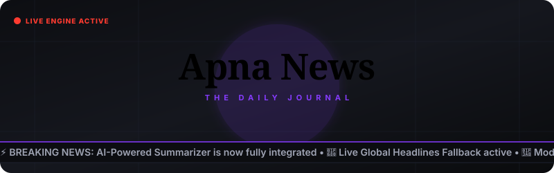

<div align="center">

<!-- Animated Header Banner -->


<br />

# 📰 Apna News
### Premium Real-Time News Aggregator & AI Summary Platform

[](https://github.com/rajveerzala67/Apna-News)
[](https://github.com/rajveerzala67/Apna-News)
[](LICENSE)
[](https://vitejs.dev)

🚀 **Apna News** is a premium, full-stack (MERN) news aggregation platform built for the modern reader. It offers personalized content recommendations, responsive dark/light newspaper layouts, real-time live breaking tickers, and instantaneous AI summaries.

[🌐 Live Demo Link (Leave Blank)]() • [📂 Report Bug](https://github.com/rajveerzala67/Apna-News/issues) • [💡 Request Feature](https://github.com/rajveerzala67/Apna-News/issues)

</div>

---

## ✨ Key Features

- **🎨 Editorial Brand & Custom Layouts**: Designed around a classical newspaper aesthetic using premium serif typography (*Playfair Display*) and an elegant custom-styled dark/light toggle.
- **🤖 Dual-AI Summarization Engine**: 
  - *Online:* Connects with Google Gemini AI (`gemini-1.5-flash`) for brief, bulleted summaries.
  - *Offline:* Automatically falls back to a locally written mathematical TF-IDF extractive sentence-ranking algorithm.
- **🔄 Multi-Layer Headline Failover**:
  - Live local categories/countries fetch via `NewsAPI`.
  - Fallback to live Global headlines if specific country limitations apply.
  - Fail-safe fallback to deterministic mock categories featuring Unsplash dynamic images in offline mode.
- **👤 Dynamic Reader Dashboard**: Easily bookmark articles, clear logs, select preferred topics, and track personal reading analytics (total read, favorite categories).
- **📊 Admin Control Center**: Monitor user sessions, inspect real-time platform views, and view ranking statistics for popular search queries and categories.
- **💾 Dual-Database Hybrid Adapter**: Launches seamlessly with **MongoDB Atlas** or hot-swaps on-the-fly to a structured local JSON registry file (`db.json`) if connection settings are offline.

---

## 🛠️ Tech Stack

<div align="center">

| Component | Technology | Description |
| :--- | :--- | :--- |
| **Frontend** | React, Vite, Tailwind CSS, Framer Motion | High-performance SPA with smooth transitions and layout controls |
| **Backend** | Node.js, Express.js | Modular, RESTful API controllers and middleware layers |
| **Database** | MongoDB Atlas / Local JSON File DB | Dual-layer persistence adapter ensuring offline local availability |
| **AI Layer** | Google Gemini API / Natural NLP Fallback | Generative text summarizations and TF-IDF sentence rankings |

</div>

---

## 📂 Project Architecture

<details>
<summary>🔍 Click to expand Directory Layout</summary>

```text
Apna-News/
├── backend/                  # Express REST API Server
│   ├── config/               # DB connections & Local JSON DB templates
│   ├── controllers/          # Business logic (News, Auth, Admin)
│   ├── data/                 # Local JSON database registry (db.json)
│   ├── middleware/           # JWT authenticators & route protectors
│   ├── models/               # MongoDB Mongoose schemas
│   ├── routes/               # API endpoint routing maps
│   ├── utils/                # Mock databases & Gemini AI engines
│   └── server.js             # Express startup file
│
├── frontend/                 # Vite + React Client SPA
│   ├── public/               # Asset icons and favicons
│   ├── src/
│   │   ├── components/       # Layouts, news card grids, and news feeds
│   │   ├── context/          # State providers (AuthContext, ThemeContext)
│   │   ├── pages/            # Core views (Home, ArticleDetail, Dashboard, Admin)
│   │   ├── App.jsx           # Client router and guard configurations
│   │   └── index.css         # Styling system & global css rules
│   └── index.html            # Main SPA HTML structure
│
└── package.json              # Monorepo script orchestrator
```
</details>

---

## 🚀 Quick Start & Installation

### Prerequisites
- Node.js installed (v16.x or higher)
- (Optional) MongoDB Atlas Cloud Database URI
- (Optional) NewsAPI & Google Gemini API Credentials

### 1. Setup Environment Variables
Create a `.env` file in the `backend/` directory:
```bash
# C:\Users\royal\OneDrive\Desktop\Apna-News\backend\.env
PORT=5000
MONGODB_URI=your_mongodb_connection_string_here
JWT_SECRET=your_jwt_signing_token_here
NEWS_API_KEY=your_newsapi_org_key_here
GEMINI_API_KEY=your_google_gemini_api_key_here
```
> ⚠️ **Note:** If `MONGODB_URI` or `NEWS_API_KEY` is omitted, Apna News will automatically run in local database/mock-feed simulation mode.

### 2. Automatic Dependency Install
Run the installer command at the root of the project to install all dependencies for the workspace, backend, and frontend at once:
```bash
npm run install-all
```

### 3. Run Development Server
Start both the Express API and the Vite React client concurrently:
```bash
npm run dev
```
- **Backend API:** `http://localhost:5000`
- **Frontend Client:** `http://localhost:5173`

---

## 🧪 Verification & Production Build
To build and check compiling integrity of the React client:
```bash
npm run build --prefix frontend
```
All assets will bundle and transpile cleanly into the `frontend/dist/` directory.

---

## 📄 License
This project is licensed under the ISC License. See the [LICENSE](LICENSE) file for details.

---

<div align="center">
  <sub>Built with ❤️ for advanced digital journalism.</sub>
</div>
